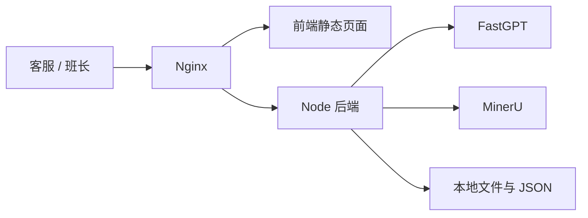

# FastGPT 对接与最小化部署评估

## 1. 当前可上线范围

基于当前代码，今天可以受控上线的主链路是：

1. 普通知识文档提交
2. 班长或运营审核
3. 发布到 FastGPT 公共知识库
4. 在前端知识列表中查看
5. 单文档问答和全局问答

当前仍应明确限制的范围：

1. `INTERNAL_SUPPORT` 文档只有在配置 `FASTGPT_INTERNAL_DATASET_ID` 后才能发布，否则会被系统阻断。
2. Excel 知识素材默认仍是 `EXTRACT_THEN_IMPORT`，不走一键直发。
3. 还没有真正的账号权限控制，前端的审核和发布按钮属于“流程管控”，不是“权限管控”。

## 2. 当前代码的部署边界

### 2.1 后端职责

后端服务监听 `0.0.0.0:${PORT}`，默认端口是 `3001`。

- 监听配置见 [server/src/index.js](/Users/tonif/Documents/trae_projects/kb-cs-assistant/server/src/index.js#L5728)
- 服务启动见 [server/src/index.js](/Users/tonif/Documents/trae_projects/kb-cs-assistant/server/src/index.js#L5747)

后端当前只托管两类静态资源：

1. `/images`
2. `/files`

对应代码见：

- [server/src/index.js](/Users/tonif/Documents/trae_projects/kb-cs-assistant/server/src/index.js#L503)
- [server/src/index.js](/Users/tonif/Documents/trae_projects/kb-cs-assistant/server/src/index.js#L504)

这意味着：

1. 后端不会直接托管前端 `client/dist`
2. 生产上需要单独托管前端静态页面
3. 建议用 Nginx 统一反向代理前端和后端

### 2.2 前端与 API 访问方式

开发环境里，Vite 通过代理把 `/api`、`/images`、`/files` 转发到后端。

配置见 [client/vite.config.ts](/Users/tonif/Documents/trae_projects/kb-cs-assistant/client/vite.config.ts#L11)。

生产环境建议保持相同路径结构：

1. 前端页面同域访问
2. `/api` 反代到 Node 后端
3. `/images` 和 `/files` 也反代到 Node 后端

否则当前开放式 CORS 会让部署边界变得不清晰。当前后端使用了全开放 `cors()`，见 [server/src/index.js](/Users/tonif/Documents/trae_projects/kb-cs-assistant/server/src/index.js#L248)。

### 2.3 文档发布依赖

当前提报发布主链路依赖这些环境变量：

1. `PORT`
2. `BASE_URL`
3. `FASTGPT_BASE_URL`
4. `FASTGPT_API_KEY`
5. `FASTGPT_WORKFLOW_KEY`
6. `FASTGPT_PUBLIC_DATASET_ID` 或 `FASTGPT_DATASET_ID`
7. `FASTGPT_INTERNAL_DATASET_ID`，仅内部支持库需要
8. `MINERU_BASE_URL`
9. `MINERU_API_TOKEN`
10. `ENABLE_LEGACY_DRAFTS=false`

相关代码位置：

- `ENABLE_LEGACY_DRAFTS` 见 [server/src/index.js](/Users/tonif/Documents/trae_projects/kb-cs-assistant/server/src/index.js#L46)
- `BASE_URL` 见 [server/src/index.js](/Users/tonif/Documents/trae_projects/kb-cs-assistant/server/src/index.js#L981)
- MinerU 调用见 [server/src/index.js](/Users/tonif/Documents/trae_projects/kb-cs-assistant/server/src/index.js#L740) 和 [server/src/index.js](/Users/tonif/Documents/trae_projects/kb-cs-assistant/server/src/index.js#L818)
- FastGPT 发布见 [server/src/index.js](/Users/tonif/Documents/trae_projects/kb-cs-assistant/server/src/index.js#L1138)
- 提报审核发布接口见 [server/src/index.js](/Users/tonif/Documents/trae_projects/kb-cs-assistant/server/src/index.js#L1199), [server/src/index.js](/Users/tonif/Documents/trae_projects/kb-cs-assistant/server/src/index.js#L1291), [server/src/index.js](/Users/tonif/Documents/trae_projects/kb-cs-assistant/server/src/index.js#L1360)
- 内部库与公共库分流见 [server/src/knowledge-workflow.js](/Users/tonif/Documents/trae_projects/kb-cs-assistant/server/src/knowledge-workflow.js#L329)

## 3. 上线前 10 分钟检查清单

### 3.1 代码与构建

1. 代码至少包含内部库阻断保护，即 `FASTGPT_INTERNAL_DATASET_ID` 未配置时内部文档不能落入公共库。
2. 前端执行过 `npm run build` 并成功产出 `client/dist`。
3. 后端可正常启动 `node src/index.js`。

### 3.2 环境变量

必须确认：

1. `FASTGPT_BASE_URL` 可访问且与当前 FastGPT API 网关路径一致。
2. `FASTGPT_API_KEY` 可用于知识库导入。
3. `FASTGPT_WORKFLOW_KEY` 可用于问答。
4. `FASTGPT_PUBLIC_DATASET_ID` 或 `FASTGPT_DATASET_ID` 已配置。
5. 若准备发布内部支持文档，则必须配置 `FASTGPT_INTERNAL_DATASET_ID`。
6. `BASE_URL` 必须是外部可访问的后端地址，否则 OCR/解析后生成的图片链接会错误。
7. 若需要上传 `.docx`、`.pdf`、`.ppt`、图片类文件，必须配置 `MINERU_BASE_URL` 与 `MINERU_API_TOKEN`。

如果今天时间非常紧，而 `MINERU_*` 还没准备好，建议只放行纯文本或 Markdown 类知识，不放行复杂文档解析。

### 3.3 反向代理

至少确认以下 3 条路径都能从浏览器访问：

1. `/api`
2. `/files`
3. `/images`

推荐反代方式：

1. `/` 指向前端静态站点
2. `/api` 指向 Node `3001`
3. `/files` 指向 Node `3001`
4. `/images` 指向 Node `3001`

### 3.4 数据与回滚

上线前至少备份这两类数据：

1. [server/src/db.json](/Users/tonif/Documents/trae_projects/kb-cs-assistant/server/src/db.json)
2. [server/public/files](/Users/tonif/Documents/trae_projects/kb-cs-assistant/server/public/files)

如果已有 OCR 图片产物，也一起备份：

1. [server/public/images](/Users/tonif/Documents/trae_projects/kb-cs-assistant/server/public/images)

### 3.5 功能冒烟

上线前至少做 5 个动作：

1. 提交一份普通客服文档
2. 审核通过
3. 发布成功
4. 在知识列表能看到该文档
5. 用全局问答和单文档问答各问一次

如果你计划放开内部支持文档，还要补 2 个动作：

1. 提交一份内部支持文档
2. 确认它发布到内部库，而不是公共库

## 4. 最小化部署环境评估

### 4.1 场景 A：FastGPT 已经单独部署，本项目只部署前后端

这是当前最适合你快速上线的方案。

最小可用配置：

1. 1 台 Linux 云主机
2. `2 vCPU / 4 GB RAM / 40 GB SSD`
3. Ubuntu 22.04 LTS 或同级别稳定发行版

适用条件：

1. 并发不高，主要是班长和少量客服使用
2. FastGPT 已经在另一台机器或另一套容器中稳定运行
3. MinerU 使用外部现成服务，不在本机自建

这套配置可以跑：

1. Nginx
2. Node 后端
3. 前端静态页面
4. 本地 JSON 文件与上传文件存储

但风险边界很明确：

1. 大文档上传和 OCR 高峰时，4 GB 内存比较紧
2. 本地文件越来越多后，40 GB 容量会吃紧
3. 没有数据库，仍依赖本地 JSON，适合先发，不适合长期放大

更稳妥的起步配置：

1. `4 vCPU / 8 GB RAM / 80 GB SSD`

这是我更建议的“最小生产”规格。

### 4.2 场景 B：本项目与 FastGPT 放在同一台机器

如果今天为了赶时间，前后端和 FastGPT 想先塞进同一台服务器，也能做，但不要按太小规格上。

非常保守的最小值：

1. `4 vCPU / 8 GB RAM / 80 GB SSD`

更安全的最小生产值：

1. `8 vCPU / 16 GB RAM / 100 GB SSD`

原因：

1. FastGPT 自身就需要 Mongo、Postgres、向量检索与模型调用资源
2. 你的项目还要处理文件上传、OCR 回调、图片落盘和问答代理
3. 同机部署时，任何一边抖动都会直接影响另一边

所以如果预算允许，我不建议长期同机。

### 4.3 场景 C：Windows 本机演示

可以演示，不建议正式生产。

原因：

1. 进程保活差
2. 文件路径和编码问题更容易出现
3. 服务治理、日志、反向代理、备份都不如 Linux 直接

## 5. 最小可发布架构

如果目标是“先上线再补优化”，建议用这个最小架构：

1. 一台 Linux 云主机部署前端静态站点、Node 后端、Nginx
2. FastGPT 保持独立部署
3. MinerU 使用现成服务，不额外自建 OCR 主机
4. 上传、提报、审核、发布先都走当前 Node 服务
5. 内部支持文档先不开或只在配置好内部库后放开

可以用 Mermaid 表示为：

## 6. 今天发布的建议口径

如果你今天就发，我建议按下面口径：

1. 发布“普通知识提报、审核、发布、问答”主链路
2. 内部支持文档发布保持关闭，除非 `FASTGPT_INTERNAL_DATASET_ID` 已配置完并验证过
3. 若 `MINERU_*` 未准备完，暂不开放复杂 Office/PDF 图片解析
4. 使用小范围内测或班长优先试运行，不建议第一天全员开放审核和发布

## 7. 下一阶段必须补的项

这次可以先不做，但不能长期不做：

1. 账号体系和角色权限
2. 审计日志
3. 数据库替代本地 JSON
4. 导入任务异步队列
5. 内部支持库单独前端入口
